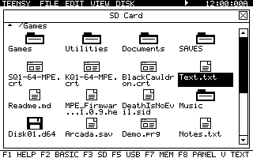

# TeensyROM Custom GUI and MHS Power Engine



This repository contains the TeensyROM+ desktop and the native MHS Power Engine
in one firmware project for **TeensyROM+ Fab0.4 with a Teensy 4.1**. The desktop
provides a mouse, joystick, and keyboard interface; the native engine runs AGI
adventure games on the Teensy while the C64 displays the game and plays its
sound.

## Download and start

1. Download [MPE Firmware V1.0.11](firmware/MPE_Firmware-V1.0.11.hex?raw=true)
   and follow the [installation guide](docs/FIRMWARE-GUIDE.md#install-the-custom-firmware).
   This complete image includes the desktop, its apps, Copy/Paste/Delete, and
   the MHS Power Engine.
2. Download the [Black Cauldron demo cartridge](Demo/The-Black-Cauldron-MPE.crt?raw=true)
   and copy it to the TeensyROM+ **SD card**. No game compilation is needed.
3. Launch the CRT from the TeensyROM menu. Follow the
   [demo instructions and controls](Demo/README.md) to start playing.

The demo was compiled from the game hosted on
[Al Lowe's games page](https://allowe.com/downloads/games.html). Its source
credits, cartridge checksum, and verification record are in [`Demo/`](Demo/README.md).
Native game cartridges launch from SD; USB and internal flash do not support
native sessions. The [official restore image](releases/native19/TeensyROM+_0.8_OFFICIAL-RESTORE_full.hex?raw=true)
and [recovery instructions](docs/FIRMWARE-GUIDE.md#restore-official-firmware)
remain available.

The experimental [DOSVM R15 package and instructions](dos/README.md) provide a
FreeDOS prompt, CGA graphics, PC-speaker sound, keyboard input, and port-2
joystick translation. It uses the same V1.0.11 firmware and includes the
matching cartridge and read-only disk image in a copy-ready SD-card layout.

See [firmware release notes](firmware/README.md) for the exact image hashes and
compatibility. Public firmware filenames use `MPE_Firmware-V1.0.11.hex`, with
the final version number increasing for each new release. The GUI's About
panel identifies the installed version. Internal build records for V1.0.11
use the `native19` profile.

Use **F1** for Help, **F2** for BASIC, and **V** to switch between the GUI and
original text menu. **F8 Control Panel > Startup > E** saves the startup menu
style; V remembers the choice too. Home and file windows share the same
clickable shortcut strip: **F1 Help, F2 BASIC, F3 SD, F5 USB, F7 MEM,
F8 Panel, and V Text**.
Check **TEENSY > About MPE Firmware** after an update's reboot to verify the
new desktop is running.

Users upgrading directly from V1.0.7 or V1.0.8 should select V1.0.11 manually;
those older versions can miss the SD card during cold startup. V1.0.9 and
V1.0.10 can offer V1.0.11 automatically. At GUI startup the desktop scans
SD-root filenames only,
offers the highest newer `MPE_Firmware-Vx.y.z.hex`, and reads the selected image
only after Update is chosen. Opening or refreshing SD performs another bounded
check. Installed and older versions are ignored, and the file is kept after
updating. See the
[startup update instructions](docs/FIRMWARE-GUIDE.md#future-updates-from-the-sd-card).

## Desktop features

The desktop uses a true 320x200 standard high-resolution VIC-II bitmap, with
one bit per pixel and a foreground/background color pair for each 8x8 cell.
It includes pixel-drawn icons, a six-pixel-spaced font, dotted wallpaper,
outlined menus, and two-line filenames of up to 22 characters with their case,
dots and extensions preserved.

- Commodore 1351 mouse on **port 1**, joystick on **port 2**, and complete
  keyboard operation.
- Folder, disk-image, program, and document icons; shared close, up, and
  scrollbar controls in file windows.
- Parent navigation uses the up control; the desktop hides the synthetic
  `/..` item while preserving the original directory entries and selections.
- Four columns and four rows of icons, with a proportional draggable scrollbar.
- One shared bitmap control library for window frames, clear X close buttons,
  application buttons, loading, messages, errors and firmware confirmations.
- F1 Help, fast icon selection, File > Boot Disk for IEC Drive 8/9, a Music panel,
  and an icon-based Control Panel with an X close button.
- A clickable menu bar, RTC clock, SID play/pause control, Control Panel, and
  movable top-level icons whose positions are saved.
- Menus reuse the displayed folder's retained background; opening or moving
  through a menu does not recapture filenames. Drawing keeps SID/mouse IRQs active.
- SD mounts are reused across browser, launch, transfer and NFC operations. Empty
  sockets avoid the multi-second mount path; failed cards retry after a bounded
  delay or an explicit refresh.
- Directories use deterministic parent/folder/file ordering and pooled filename
  storage, remaining responsive at the firmware's 4,000-entry limit.
- Drive 8/9 directory browsing and PRG launching, plus SD and USB browsing.
- Snake, Calculator, and the read-only Text Viewer are separate desktop apps in
  the `GeosApps` payload, launched from **TEENSY**. Their close button or STOP
  returns to the core desktop without a reset.
- The compact cartridge and classic list view remain available as recovery
  paths, along with the confirmed firmware-update route.

**Copy** and **Paste** work on individual files in SD and USB folders, including
copies between the two. Paste verifies the copy and refuses an existing
destination filename. **Delete** displays the selected filename and asks for
permanent deletion, with Cancel selected initially. There is no persistent
Trash or recovery store. Folder operations, disk-image contents, and IEC writes
are outside these file operations.

See [File Operations](docs/FILE-OPERATIONS.md) for shortcuts and
[Desktop Usage](docs/CUSTOM-DESKTOP.md) for the complete interface. Open the
[interactive design preview](docs/ui-preview/index.html) through a local HTTP
server to explore the desktop design. The [UI system](docs/UI-SYSTEM.md)
documents the shared controls and their input rules; the
[desktop performance record](Source/C64/MainMenuCRT/UI_PERFORMANCE.md) records
the bounded redraw measurements used by V1.0.11.

## Native MHS Power Engine

The Teensy runs original AGI bytecode, parser handling, motion, collision,
picture and actor rendering, and game state. The C64 presents acknowledged
frames and SID sound and supplies keyboard, joystick, and optional 1351 mouse
input. Native gameplay does not emulate a 6510 or require optional PSRAM.

The MHS Power Engine code remains available in Teensy flash. Its game workspace
is constructed in the shared arena only when a session needs it. Title
playback, an active Power Engine game session, legacy MPE2 compatibility, and
native DOS share one 64 KiB RAM2 arena.
The title hands that arena directly to Power Engine when a game launches.
Title, Power Engine, and MPE2 release it on a clean exit or reset so another
mode can reuse it. DOS seals the arena for reset-only direct execution; leaving
DOS requires a reset before another owner can claim that memory.

Keyboard events and mouse-button transitions use ordered queues at the native
engine boundary. Pointer motion and held joystick direction coalesce to their
latest state, while a full queue leaves the C64 event unacknowledged for exact
retry. This keeps input intact while a large sprite frame is still transferring.

Game resources live in the CRT; the firmware works with compatible game
packages. Small games retain their 1 MiB boot layout, while larger native
packages can use up to 4 MiB with resource banks read by the Teensy. Each
packaged game has its own SD save slot in **SAVES**, created automatically.
Older root-folder saves remain readable. Native CRTs require the matching MPE
firmware; stock firmware and VICE cannot run native gameplay.

The [AGI-64 Compiler](https://meanhamster.com/games/agi-64) remains a separate
project for compiling other supported game sources. Select **MHS Power Engine**
and use its matching firmware kit. See the
[native firmware guide](docs/FIRMWARE-GUIDE.md) for installation, storage,
controls, saves, and recovery.

The combined firmware also retains earlier MPE acceleration services for
compatible older cartridges. Their PowerVM, picture-DMA, and C64 fallback
documentation is collected under [legacy acceleration](docs/Architecture/GENERIC-ACCELERATION.md).
Those interfaces describe a different execution path from the MHS Power Engine
runtime above.

## Source layout

| Path | Contents |
| --- | --- |
| `Source/C64/MainMenuCRT/` | Desktop development sources and focused tests. |
| `Source/Teensy/` | TeensyROM and desktop backend development sources. |
| `engine/` | Native engine, ordered integration patches, selected GUI backend policy, and licensed legacy dependency. |
| `gui/selected-v1.0.11/` | GUI inputs and provenance lock selected for V1.0.11 / native19. |
| `gui/selected-v1.0.10/` | Preserved GUI inputs used by V1.0.10 / native18. |
| `gui/selected-v1.0.9/` | Preserved GUI inputs used by V1.0.9 / native17. |
| `gui/selected-ac4a5d6/` | Preserved GUI inputs used by native08. |
| `gui/selected-e305/` | Preserved GUI inputs used by native05 through native07. |
| `scripts/` | Combined firmware builder, GUI assembly, and validation tools. |
| `tests/` | Native engine, session, cartridge, and firmware checks. |
| `firmware/` | Only the current combined firmware image and its README. |
| `docs/firmware/` | Current download checksums and source lock. |
| `releases/` | Immutable firmware kits, restore images, and source manifests. |
| `Demo/` | Ready-to-use Black Cauldron CRT, instructions, credits, and checksums. |
| `dos/` | Ready-to-use DOSVM CRT/disk, installation instructions, sources, and focused checks. |

The combined builder consumes the locked GUI snapshot in `gui/` and the
integration sources in `engine/`. A change in the desktop development tree
must be reviewed and incorporated into that selected snapshot before it
becomes part of a new native release; backend changes also require a matching
backend patch and policy. Merely editing
`Source/` does not change the pinned native19 build inputs.

## Build the combined firmware on Windows

Install Git, Node.js 20.11 or later, PowerShell, and ACME 0.97. First follow the
[locked release-source instructions](docs/FIRMWARE-GUIDE.md#reproduce-the-release-source)
to check out the exact `engineCommit` in `docs/firmware/source.lock.json`.
This reproduces the 46-patch combined MHS Power Engine release, including the
separately recorded Power Engine game-runtime sources, native DOS sources, and
one shared native runtime source. Later development on `main` can use a
different builder. From that worktree's root, run:

```powershell
.\scripts\build-firmware.ps1 -CustomGuiAcmePath C:\Tools\ACME\acme.exe
```

The builder obtains the pinned upstream source and Arduino CLI 1.4.1, Teensy
core 1.61.0, and CRC32 2.0.0 when needed. It verifies the patch chain and GUI
inputs, assembles and checks the selected C64 menu, runs conformance checks,
builds both firmware halves, and checks memory reserves. It does not flash
hardware.

Output defaults to `build/native19/`, with disposable source in `source/`,
firmware in `firmware/`, and provenance in `manifests/`. The toolchain cache
defaults to `build/toolchain/`. Use `-ToolchainRoot` and `-OutputRoot` to select
other locations; ACME can also be on `PATH`. Use `-SourcePath` only for a
disposable checkout at the pinned upstream commit.

See [Build Provenance](docs/BUILD-PROVENANCE.md) for source pins and release
records. The lower-level `Source/Teensy/tools/Build-DualBoot.ps1` workflow is
for the `Source/` development tree; use the root builder above to reproduce
the combined native MPE release.

## Development checks and hardware status

Focused desktop checks run from the repository root:

```powershell
node Source/Teensy/MinimalBoot/tests/agi-picture-conformance.mjs
node --test Source/C64/MainMenuCRT/tests/*.test.js Source/C64/MainMenuCRT/tests/*.test.mjs
node scripts/generate-desktop-bitmap-assets.mjs --check
```

For desktop development, rebuild the C64 menu with
`scripts/build-c64-menu.ps1 -AcmePath C:\Tools\ACME\acme.exe` before building
the `Source/` firmware tree. That script accepts `-PythonPath` or uses Python
from `PATH`. See [native test instructions](tests/README.md) for the engine
and cartridge checks; the full game test catalog requires separate fixtures.

Each release records its build and host checks. Physical C64/128,
SD/USB file-operation, and mouse acceptance remain separate. The Black
Cauldron demo has passed native startup, input, rendering, and loader checks;
a complete playthrough and physical gameplay have not been verified for this
download.

## Credits

The custom GUI and MHS Power Engine are developed by **John Swiderski** of
**[Mean Hamster Software](https://meanhamster.com)**. The desktop's About panel
shows these credits and the installed MPE firmware version.

Based on [SensoriumEmbedded/TeensyROM](https://github.com/SensoriumEmbedded/TeensyROM)
at commit `3436b8fbd7c642ef9eabc691d3d09da08a6a6690`, with upstream
notices retained. See [LICENSE.md](LICENSE.md),
[the TeensyROM license](docs/TEENSYROM-LICENSE.md), and the dependency licenses
in `engine/vendor/`. The included game's original ownership and attribution
are documented in [Demo credits](Demo/README.md#source-and-credits).
