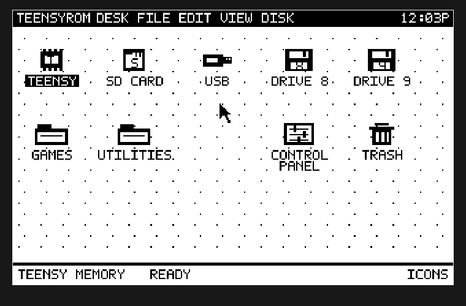

# TeensyROM Custom GUI and MHS Power Engine



This repository contains the TeensyROM+ desktop and the native MHS Power Engine
in one firmware project for **TeensyROM+ Fab0.4 with a Teensy 4.1**. The desktop
provides a mouse, joystick, and keyboard interface; the native engine runs AGI
adventure games on the Teensy while the C64 displays the game and plays its
sound.

## Download and start

1. Download the [current native09 firmware](firmware/MHS-PowerEngine-TRPlus-v1_full.hex?raw=true)
   and follow the [installation guide](docs/FIRMWARE-GUIDE.md#install-the-custom-firmware).
   This complete image includes the desktop, its apps, Copy/Paste/Delete, and
   the native game engine.
2. Download the [Black Cauldron demo cartridge](Demo/The-Black-Cauldron-MPE.crt?raw=true)
   and copy it to the TeensyROM+ **SD card**. No game compilation is needed.
3. Launch the CRT from the TeensyROM menu. Follow the
   [demo instructions and controls](Demo/README.md) to start playing.

The demo was compiled from the game hosted on
[Al Lowe's games page](https://allowe.com/downloads/games.html). Its source
credits, cartridge checksum, and verification record are in [`Demo/`](Demo/README.md).
Native game cartridges launch from SD; USB and internal flash do not support
native sessions. The [official restore image](releases/native08/TeensyROM+_0.8_OFFICIAL-RESTORE_full.hex?raw=true)
and [recovery instructions](docs/FIRMWARE-GUIDE.md#restore-official-firmware)
remain available.

See [firmware release notes](firmware/README.md) for the exact image hashes and
compatibility. Native09 adds tidy parent navigation and an animated launch
loading bar to the desktop, alongside the native07 AGI engine and its corrected
dialogue key waits. Existing native06 and
native07 cartridges and per-game saves remain compatible.

## Desktop features

The desktop uses a true 320x200 standard high-resolution VIC-II bitmap, with
one bit per pixel and a foreground/background color pair for each 8x8 cell.
It includes pixel-drawn icons, a six-pixel-spaced font, dotted wallpaper,
outlined menus, and two-line filenames of up to 20 characters.

- Commodore 1351 mouse on **port 1**, joystick on **port 2**, and complete
  keyboard operation.
- Folder, disk-image, program, and document icons; close, up, and page-arrow
  controls in file windows.
- A clickable menu bar, RTC clock, SID play/pause control, Control Panel, and
  movable top-level icons whose positions are saved.
- Drive 8/9 directory browsing and PRG launching, plus SD and USB browsing.
- Resident black-and-white Snake, integer Calculator, and paged Text Viewer
  apps. Their close button or STOP returns to the desktop without a reset.
- The compact cartridge and classic list view remain available as recovery
  paths, along with the confirmed firmware-update route.

**Copy** and **Paste** work on individual files in SD and USB folders, including
copies between the two. Paste verifies the copy and refuses an existing
destination filename. **Delete** displays the selected filename and asks for
permanent deletion, with Cancel selected initially. There is no persistent
Trash or recovery store. Folder operations, disk-image contents, and IEC writes
are outside these file operations.

See [File Operations](docs/FILE-OPERATIONS.md) for shortcuts and
[Desktop Usage](docs/CUSTOM-DESKTOP.md) for the complete interface. Open the
[interactive design preview](docs/mockup/index.html) locally to explore the
desktop design.

## Native MHS Power Engine

The Teensy runs original AGI bytecode, parser handling, motion, collision,
picture and actor rendering, and game state. The C64 presents acknowledged
frames and SID sound and supplies keyboard, joystick, and optional 1351 mouse
input. Native gameplay does not emulate a 6510 or require optional PSRAM.

Game resources live in the CRT; the firmware works with compatible game
packages. Small games retain their 1 MiB boot layout, while larger native
packages can use up to 4 MiB with resource banks read by the Teensy. Each
packaged game has its own SD save slot. Native CRTs require the matching MPE
firmware; stock firmware and VICE cannot run native gameplay.

The [AGI-64 Compiler](https://github.com/ziggystar12/AGI-64) remains a separate
project for compiling other supported game sources. Select **MHS Power Engine
(native AGI)** and use its matching firmware kit. See the
[native firmware guide](docs/FIRMWARE-GUIDE.md) for installation, storage,
controls, saves, and recovery.

The combined firmware also retains earlier MPE acceleration services for
compatible older cartridges. Their PowerVM, picture-DMA, and C64 fallback
documentation is collected under [legacy acceleration](docs/Architecture/GENERIC-ACCELERATION.md).
Those interfaces describe a different execution path from the native AGI
engine above.

## Source layout

| Path | Contents |
| --- | --- |
| `Source/C64/MainMenuCRT/` | Desktop development sources and focused tests. |
| `Source/Teensy/` | TeensyROM and desktop backend development sources. |
| `engine/` | Native engine, ordered integration patches, selected GUI backend policy, and licensed legacy dependency. |
| `gui/selected-native09/` | Current reviewed GUI inputs and provenance lock. |
| `gui/selected-ac4a5d6/` | Preserved GUI inputs used by native08. |
| `gui/selected-e305/` | Preserved GUI inputs used by native05 through native07. |
| `scripts/` | Combined firmware builder, GUI assembly, and validation tools. |
| `tests/` | Native engine, session, cartridge, and firmware checks. |
| `firmware/` | Only the current combined firmware image and its README. |
| `docs/firmware/` | Current download checksums and source lock. |
| `releases/` | Immutable native05 through native09 firmware kits, restore images, and source manifests. |
| `Demo/` | Ready-to-use Black Cauldron CRT, instructions, credits, and checksums. |

The combined builder consumes the locked GUI snapshot in `gui/` and the
integration sources in `engine/`. A change in the desktop development tree
must be reviewed and incorporated into that selected snapshot before it
becomes part of a new native release; backend changes also require a matching
backend patch and policy. Merely editing
`Source/` does not change the pinned native09 build inputs.

## Build the combined firmware on Windows

Install Git, Node.js 20.11 or later, PowerShell, and ACME 0.97. From the
repository root, run:

```powershell
.\scripts\build-firmware.ps1 -CustomGuiAcmePath C:\Tools\ACME\acme.exe
```

The builder obtains the pinned upstream source and Arduino CLI 1.4.1, Teensy
core 1.61.0, and CRC32 2.0.0 when needed. It verifies the patch chain and GUI
inputs, assembles and checks the selected C64 menu, runs conformance checks,
builds both firmware halves, and checks memory reserves. It does not flash
hardware.

Output defaults to `build/native09/`, with disposable source in `source/`,
firmware in `firmware/`, and provenance in `manifests/`. The toolchain cache
defaults to `build/toolchain/`. Use `-ToolchainRoot` and `-OutputRoot` to select
other locations; ACME can also be on `PATH`. Use `-SourcePath` only for a
disposable checkout at the pinned upstream commit.

See [Build Provenance](docs/BUILD-PROVENANCE.md) for source pins and release
records. The lower-level `Source/Teensy/tools/Build-DualBoot.ps1` workflow is
for the `Source/` development tree; use the root builder above to reproduce
the combined native MPE release.

## Development checks and hardware status

Focused desktop checks run from the repository root:

```powershell
node Source/Teensy/MinimalBoot/tests/agi-picture-conformance.mjs
node --test Source/C64/MainMenuCRT/tests/*.test.js Source/C64/MainMenuCRT/tests/*.test.mjs
node scripts/generate-desktop-bitmap-assets.mjs --check
```

For desktop development, rebuild the C64 menu with
`scripts/build-c64-menu.ps1 -AcmePath C:\Tools\ACME\acme.exe` before building
the `Source/` firmware tree. That script accepts `-PythonPath` or uses Python
from `PATH`. See [native test instructions](tests/README.md) for the engine
and cartridge checks; the full game test catalog requires separate fixtures.

Native08 has passed its recorded build and host checks. Physical C64/128,
SD/USB file-operation, and mouse acceptance remain separate. The Black
Cauldron demo has passed native startup, input, rendering, and loader checks;
a complete playthrough and physical gameplay have not been verified for this
download.

## Credits

Based on [SensoriumEmbedded/TeensyROM](https://github.com/SensoriumEmbedded/TeensyROM)
at commit `3436b8fbd7c642ef9eabc691d3d09da08a6a6690`, with upstream
notices retained. See [LICENSE.md](LICENSE.md),
[the TeensyROM license](docs/TEENSYROM-LICENSE.md), and the dependency licenses
in `engine/vendor/`. The included game's original ownership and attribution
are documented in [Demo credits](Demo/README.md#source-and-credits).
