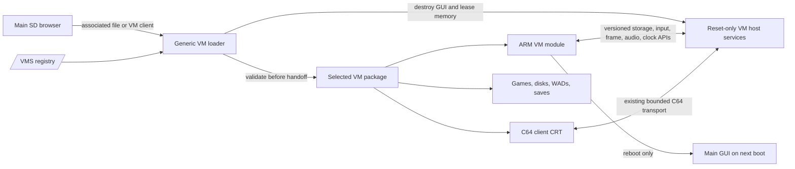

# Modular VM Platform and 1 MiB DoomVM Plan

Status: NES baseline merged and synchronized; independent DOSVM and ABI 2
RAM1-code/support / RAM2-guest test candidate implemented. Physical acceptance
gates and the explicitly deferred flash/XIP profile remain open.

Latest AGI update: standalone AGIVM now builds against unchanged V1.1.1 / ABI 2.
It supplies `.AGI` content loading, direct selection, a 17-row paged picker,
RAM2 game state/resource caching, RAM1 interpreter/render/input support, sprites,
SID and generic-API save/restore. KQ1 reaches room 1 and SQ1 room 2 in module
tests. See [AGI test status](AGI-MODULAR-TEST-STATUS.md). Physical gameplay remains
open. The CLI compiler bridge and the separate AGI-64 desktop compiler 1.0.33
MPE option both produce standalone `.AGI` content through the shared builder.

## September 4 execution update — overrides the earlier migration details

The user explicitly removed backwards compatibility and requested a fresh
NES-only GUI test. `Source/` is the single current GUI input tree; the old
`gui/selected-*` copies and the monolithic firmware build path are retired.
All VM engines are excluded from the new firmware. The NES-only baseline was
committed as `2baab38d7772d9e4748d8050d6a7e85597305be9` on `main`.
The user confirmed SMB launches, but reported severe slowdown and visible
scanline-block drawing. The next requested step is now an independent DOSVM
speed-comparison build, before returning to NES optimization. AGI and Doom
extraction remains later work; no built-in fallback or compatibility is retained.

The executable pilot ABI is documented in `vm/abi/README.md`, with the exact
shared header in `Source/Teensy/MinimalBoot/Common/VMABI.h`. It uses bounded
`manifest.vmi` files and CRC-protected `engine.mvm` images. No signatures are
required for this trusted-local, unreleased product. The original VM.INI names,
legacy aliases and signed-example requirements below are superseded.

V1.1.1 / ABI 2 supersedes the first pilot's memory layout: reset-time core
initialization selects 192 KiB ITCM / 320 KiB DTCM. The GUI resets into
MinimalBoot before loading module code; there is no live repartition.
The host and selected module each have a 96 KiB ITCM code region. RAM1 also
provides 192 KiB for module data/BSS/support and a separate 48 KiB stack.
All 512 KiB RAM2 is exclusively emulated-machine RAM/backing, not emulator
control state, rendering buffers or executable code. Host heap/state stay in
DTCM, USB is disabled in the VM host and SD uses FIFO. Both NES and DOS follow
this model and reuse the same ranges: only one engine loads at a time.
Both fit the RAM1-only profile. Flash/XIP profiles and interrupted module-cache
installation testing remain deferred, not claimed as completed. The later
Doom sizing proposals below are future design targets, not this implemented map.

The current build/test results are in
`docs/Architecture/DOS-MODULAR-TEST-STATUS.md`; the original ABI 1 report is
`docs/Architecture/NES-ONLY-TEST-STATUS.md`. Current downloads are in `firmware/`
and `vms/{NESVM,DOSVM}`. DOS preserves Tandy 08/09 graphics and three-voice
sound; generic writable storage services are in the host, with DOS policy in
the module. Use the disk-free DOS update ZIP to preserve existing drives.

Next priorities: (1) physical V1.1.1 GUI/DOS boot, input, disk and speed check;
(2) NES ABI 2 retest and measured emulation/transport/presentation optimization;
(3) long-run crash/stress acceptance; (4) remaining AGI/Doom extraction.
The historical step exit gates below
are not satisfied merely because firmware compiles. The exact old installed
DOS/SMB pair, physical crash causes, long-running bus stress, power/reset tests,
and actual gameplay acceptance remain unverified until hardware testing.

Date: 2026-09-04

Hardware basis: [SensoriumEmbedded TeensyROM+ PCB v0.4 with Teensy 4.1](https://github.com/SensoriumEmbedded/TeensyROM/tree/main).
The upstream [v0.4 hardware description](https://github.com/SensoriumEmbedded/TeensyROM/blob/main/docs/TR%2BNewFeatures.md)
establishes the cartridge's additional bus control. [PJRC's Teensy 4.1 specifications](https://www.pjrc.com/store/teensy41.html)
establish 1 MiB internal RAM, 8 MiB program flash, and optional memory expansion.
The public README's BOM/schematic links currently target v0.3; they must not be
represented as verification of fitted v0.4 PSRAM. Budget only 512 KiB RAM1 and
the separate 512 KiB RAM2. A physical memory probe records any optional PSRAM.

Source snapshot reviewed: `18bf8c31bbc05e8d322cf5327f5ef8a07b4468b2`.
This plan supersedes earlier engine-in-firmware and required-PSRAM proposals.

## Executive decision

The firmware will become a generic, reset-only VM host. AGIVM, DOSVM, NESVM,
and DOOMVM will become independently installable packages under `/VMS`; their
game, emulator, picker, and customization logic will no longer be compiled into
the GUI firmware.

Launching a VM is a destructive handoff, as DOSVM already models:

1. The GUI validates the package, selected content, ABI, memory request, and
   module integrity while the GUI is still intact.
2. The host closes or quiesces GUI-only services and releases the resident CRT,
   `RAM_Image`, swap buffers, and other proved-dead GUI state.
3. The VM takes its declared RAM1 layout and RAM2 working arena. The GUI is no
   longer recoverable in that boot.
4. Returning from a VM means rebooting the Teensy/C64. There is no module unload,
   GUI reconstruction, or safe-return requirement.

The launch experience supports both useful paths:

- Selecting a game file such as `KQ1.AGI` or `Crossbow.NES` starts the matching
  installed VM with that file already selected.
- Selecting a VM's client CRT without a game starts that VM's own picker.

For Doom, the baseline target is the real Teensy 4.1 internal-memory system:
512 KiB RAM1 plus 512 KiB RAM2 and **no required PSRAM**. RAM2 remains a
standardized 512 KiB VM working arena and contains no executable VM code.
Reclaiming the GUI at handoff makes all Doom executable text in a 256 KiB ITCM
VM image the primary design target. A verified one-module program-flash cache
holds the installed module and read-only data; execution in place from that
cache is a fallback only if the measured Cortex-M7 image cannot meet the RAM1
and stack guards.

Modularization is not presumed to fix the newly observed NESVM and DOSVM
failures. Those failures are separate regression gates that must be reproduced,
classified, and proved fixed.

## Non-negotiable platform rules

1. **Generic firmware only.** The firmware owns loading, validation, hardware
   transport, storage services, input, presentation, audio, timing, diagnostics,
   memory handoff, and reboot. It does not know AGI opcodes, 8086 instructions,
   NES mappers, Doom thinkers, or game-specific menus.
2. **One active VM.** Only one VM package is loaded in a boot. Twenty installed
   VMs consume SD space, not twenty permanent firmware slots.
3. **Reset-only lifecycle.** A VM may return to its own internal game picker,
   but it never returns to the main GUI. Exiting the VM reboots.
4. **RAM2 is working memory, never module code.** The address range and lease
   protocol are common. DOSVM and DOOMVM receive the full exclusive 512 KiB;
   smaller VMs may request less, but their executable code still stays out.
5. **RAM1 is measured, not assumed.** Teensy 4.1 RAM1 is one 512 KiB FlexRAM pool
   divided into 32 KiB ITCM code banks and DTCM data/stack banks. A VM-mode split
   must be selected from an exact linker map and stack high-water result.
6. **No PSRAM baseline.** Fitted PSRAM may be offered as an optional cache. No
   VM's required feature set or successful path may depend on it.
7. **No new per-cycle ISR work.** Package discovery, hashing, SD I/O, flash
   programming, and module work remain outside the PHI2 ISR path, following
   [the hard constraints](Constraints.md).
8. **The SD package is authoritative.** The program-flash module slot is a
   disposable cache for one selected VM, not part of the firmware release.
9. **Trusted native modules.** Version 1 runs user-installed, trusted ARM code.
   Hashes and bounds checks detect damaged packages; they provide no sandbox.
   Optional publisher signatures can follow. Never compile a per-module
   allow-list into firmware that requires an update for every new VM.
10. **Physical hardware is the final gate.** Host tests, VICE, link maps, and
    packet replay do not establish operation on a TeensyROM Fab 0.4 and C64.

## Current state and why it must change

The current V1.0.21/native29 image is explicitly a combined firmware image.
Each engine is unity-included in the firmware build, while its roughly 25 KiB
CRT is chiefly a C64 terminal, boot descriptor, and sometimes resources. The CRT
size therefore says nothing about the size of the ARM engine behind it.

| VM | Current coupling | Current content path | Memory behavior |
| --- | --- | --- | --- |
| AGIVM/MPE4 | Interpreter, session, renderer, and package reader are firmware-linked | Game resources are inside an M4G2 CRT; saves use `/SAVES` | Existing 64 KiB native arena |
| DOSVM/MPE5 | 8086 core, platform, video, audio, and filesystems are firmware-linked | `/DOSVM/DOSVM.IMG` and `/DOSVM/D` | Reset-only ownership of all 512 KiB RAM2 |
| NESVM/MPE6 | CPU, PPU, mapper, renderer, SID adapter, and ROM picker are firmware-linked | `/NESVM/ROMS` and `/NESVM/SAVES` | Uses the resident-CRT tail in RAM1; leaves RAM2 alone |
| DOOMVM/MPE7 | Doom runtime/session is firmware-linked | `/DOOMVM/DOOM1.WAD` | Current prototype requires an 8 MiB PSRAM zone and cannot meet the new baseline unchanged |

The firmware builder currently stages every engine separately and validates
engine-specific symbols and memory rules. Launch dispatch contains explicit
MPE4/MPE5/MPE6/MPE7 branches. The browser also uses a compile-time extension
table and duplicate C64/Teensy file-type enums. Adding VM number 20 would
therefore require another firmware build under the present model.

Relevant current evidence:

- [V1.0.21/native29 validation](../validation/MPE-V1.0.21.md)
- [AGI firmware integration](../../engine/native-game/mpe4_firmware.h)
- [DOS firmware integration](../../engine/native-dos/mpe5_firmware.h)
- [NES firmware integration](../../engine/native-nes/mpe6_firmware.h)
- [Doom firmware integration](../../engine/native-doom/mpe7_firmware.h)
- [Static file associations](../../Source/Teensy/MinimalBoot/Common/DriveDirLoad.h)
- [Current fixed file-type enum](../../Source/Teensy/MinimalBoot/Common/Menu_Regs.h)
- [Combined firmware builder](../../scripts/build-firmware.ps1)

The 8,145,548-byte V1.0.21 `.hex` file recorded in the validation report is an
ASCII Intel HEX artifact. Its file length is neither RAM consumption nor a
direct statement of binary flash occupancy. Future memory decisions must use
ELF sections, linker symbols, and runtime high-water measurements.

## Field regressions to preserve as evidence

The following observations came from physical hardware on 2026-09-04 and now
override the earlier “physical acceptance pending” status. They prove failures,
not their causes.

| ID | Observed behavior | Evidence that must survive diagnosis |
| --- | --- | --- |
| HW-DOS-01 | DOSVM screen identifies `TRANSPORT DIAG R23`, then stops at `STAGE 03`, `ERROR 03`, `PACKETS 0000` | No packet was completed. The captured firmware detail byte is `04`, a shared memory/startup class used by several current gates, not a unique cause. The repository's current documented cartridge is R24, so the installed firmware, CRT revision/hash, and SD image must be identified first. |
| HW-NES-01 | NESVM Crossbow stops at `STAGE 05`, `ERROR 03`, after `PACKETS 12CC`; last packet is SID type `02`, sequence `E0` | This is a later, sustained transport/runtime failure, not the same symptom as the DOS zero-packet startup failure. The displayed control registers have already changed by the time of the snapshot, so preserve and latch the triggering status plus the complete F0-FF register dump. |
| HW-NES-02 | Super Mario Bros. draws its first screen and then crashes | Record ROM SHA-256/header/mapper, final diagnostic registers, packet count, CPU/PPU state, and whether the result is a held error, watchdog reset, or lockup. |
| HW-NES-03 | Moving the ROM selection down by one row blanks and redraws the whole display | Current code rebuilds a fresh frame, clears all 1,000 cells, and marks the menu dirty after every Up/Down selection. This is a known design problem, not merely subjective flicker. |
| HW-NES-04 | Left/Right does not page through the ROM list | The current menu handles Up, Down, A, and Start, but not Left/Right navigation. |
| HW-DOS-02 | The currently installed DOSVM now crashes | Reproduce only after an exact firmware/CRT pairing check; keep startup failure separate from any later guest crash. |

No architecture milestone may close these items merely because the engines moved
out of the firmware. A defect closes only when the corresponding instrumented
test and physical acceptance test pass.

## Target architecture



The GUI exists only through validation and handoff. The active VM host is a
small generic runtime, not the desktop GUI. It retains only the state required
for the C64 bus, SD access, transport, input, audio, clocks, diagnostics, and
reboot.

## SD installation layout

```text
/VMS/
  AGIVM/
    VM.INI
    AGIVM.CRT
    RUNTIME/AGIVM.MVM
    GAMES/*.AGI
    SAVES/
    CACHE/
  DOSVM/
    VM.INI
    DOSVM.CRT
    RUNTIME/DOSVM.MVM
    SYSTEM/DOSVM.IMG
    DRIVES/D/
    SAVES/
  NESVM/
    VM.INI
    NESVM.CRT
    RUNTIME/NESVM.MVM
    ROMS/*.NES
    SAVES/
  DOOMVM/
    VM.INI
    DOOMVM.CRT
    RUNTIME/DOOMVM.MVM
    WADS/*.WAD
    CACHE/
    SAVES/
```

Rules for that tree:

- `VM.INI`, the client CRT, and `RUNTIME` are replaceable program files.
- `GAMES`, `ROMS`, `WADS`, `DRIVES`, and `SAVES` are user data and are never
  deleted, renamed, or overwritten by a VM update.
- `SYSTEM/DOSVM.IMG` is also writable user data. Supply an initial image only
  when absent; runtime updates must preserve the existing image byte-for-byte.
- All manifest paths are relative to the package root. No module hard-codes
  `/NESVM`, `/DOSVM`, or `/DOOMVM`.
- Root `AGIVM.CRT`, `DOSVM.CRT`, `NESVM.CRT`, and `DOOMVM.CRT` may remain as
  newly generated compatibility launchers. They carry a generic package-ID
  descriptor; the loader does not recognize engine names in CRT titles.
- Existing `/SAVES`, `/DOSVM`, `/NESVM`, and `/DOOMVM` paths remain supported for
  at least one migration release. Resolve one active writable save/disk root
  before launch and retain it; never split writes silently between old/new
  locations. Legacy fallback paths for immutable content may be read-only.
- The migration never silently moves writable user data. A separate, explicit
  migration tool may copy and verify it later.

## Launch and file-association behavior

The firmware gains exactly one generic browser route, conceptually
`VM-associated content`. It does not gain `.AGI`, `.NES`, `.WAD`, and future VM
switch cases.

At boot, bounded manifests register associations. The registry rejects duplicate
claims and prevents a VM from taking protected core types such as `.CRT`, `.HEX`,
and `.PRG`. Associated content is dispatched before the existing generic
bulk-file loader tries to place the whole file in cartridge RAM.

For a VM client `.CRT`, the existing CRT parser recognizes a generic VM-launch
descriptor and resolves its package ID through that registry. This is one shared
descriptor format; a VM cannot claim ordinary cartridge files by filename.

### AGIVM

- The AGI-64 compiler emits a real, validated `.AGI` content package plus the
  legacy `.CRT` during migration.
- `.AGI` initially wraps or evolves the current indexed/checksummed M4G2 content
  and preserves stable game/save identity. Renaming an existing `.CRT` to `.AGI`
  is not a package conversion and is not supported.
- Existing AGI games are regenerated as `.AGI` from their compiler inputs with
  stable save IDs. Preserve the previous CRT/firmware pair for rollback; do not
  promise unchanged legacy AGI CRT execution after embedded AGI is removed.
- Selecting an `.AGI` anywhere on SD starts AGIVM with an opaque selected-file
  token. AGIVM reopens and validates it through the host storage service.
- Starting `AGIVM.CRT` without a token opens AGIVM's picker at
  `/VMS/AGIVM/GAMES`.
- The firmware may supply generic directory/paging primitives, but filters,
  titles, game metadata, and picker behavior belong to AGIVM.

### NESVM

- Selecting `.NES` starts NESVM directly; starting `NESVM.CRT` opens the ROM
  picker at `/VMS/NESVM/ROMS`.
- Returning from a game to the NESVM picker is allowed because it remains inside
  the same active VM. Returning to the main GUI is not supported; reboot does it.
- The selected ROM row is retained when returning to the NESVM picker.

### DOSVM

- The initial DOSVM package boots its configured `SYSTEM/DOSVM.IMG` and exposes
  `DRIVES/D`; it does not claim every `.IMG` file on the SD card.
- Starting `DOSVM.CRT` enters DOSVM directly. A future unique DOS session/profile
  extension can be registered without changing firmware.
- DOSVM remains the reference full-RAM2, reset-only ownership implementation.

### DOOMVM

- Starting `DOOMVM.CRT` opens a WAD picker. Selecting a supported `.WAD` may also
  launch DOOMVM directly.
- The WAD remains user-owned SD content and is streamed with bounded read-at
  calls. A desktop build tool may create optional pre-indexed data in `CACHE`,
  but the source WAD is never embedded in firmware.
- Compatibility is declared by hash/header and required-lump validation, not by
  assuming every file named `.WAD` is playable.

The extension parser should accept bounded 1-8 character extensions even though
the first three direct-launch types are three characters. This prevents the new
generic design from recreating today's three-character limitation.

## Package and module contracts

### Bounded discovery manifest (`VM.INI`)

The discovery manifest is human-readable, at most 4 KiB, and parsed into a fixed
record. It declares:

- package ID, display name, semantic version, and publisher;
- module and C64-client relative paths plus SHA-256 values;
- loader format and supported host ABI range;
- required host capabilities and minimum versions;
- reset-only lifecycle;
- RAM1 text/data/stack request, a supported FlexRAM profile, and RAM2 lease;
- optional PSRAM cache request, never a baseline requirement;
- content associations, magic checks, default picker folder, save folder, and
  legacy read-only paths.

Scanning twenty manifests must not allocate from RAM2 or retain all manifest
strings. The firmware may generate a disposable fixed-record registry cache, but
the manifests remain authoritative.

### Native module (`*.MVM`)

The security-critical binary header, not `VM.INI`, authoritatively defines:

- magic, header size, target (`ARMv7E-M`, Thumb-2), ABI, and flags;
- text, hot-text, read-only, initialized-data, BSS, relocation, import, and entry
  tables with sizes, offsets, alignment, and destination classes;
- stack and RAM2 request;
- module/content identity and cryptographic digest, plus optional signature;
- `init`, bounded `step`, diagnostics, and fatal/reboot entry points.

All additions are size-versioned and fixed-width. Modules do not import Arduino
classes, `FsFile`, C++ standard-library ABI objects, or arbitrary firmware
symbols.

The SDK must pin the compiler CPU/FPU/calling convention, supported relocation
types, and section permissions. Constructors and any library runtime are
explicitly initialized once; no unload/destructor path is required. The loader
rejects an unsupported relocation before activation and performs the required
cache maintenance and memory barriers before executing newly loaded text.

### Generic host services

A versioned `query_service(id, version)` table provides opaque handles for:

- open/stat/read-at/seek/list and bounded atomic file replacement;
- selected-content token resolution;
- cell/indexed-frame submission, dirty spans, and frame acknowledgement;
- keyboard events and held state, port-2 joystick, and optional mouse;
- SID/audio command queues;
- monotonic clock and cooperative scheduling;
- RAM1/RAM2 region discovery and guarded allocator telemetry;
- structured logs, fault capture, diagnostic screen, watchdog, and reboot.

Future serial-port support is a new optional host capability. Adding an AGI game,
NES mapper inside NESVM, Doom renderer option, or DOS program is not a firmware
feature and does not justify a firmware release.

VM code never runs in the cycle-critical PHI2 ISR. The existing handler performs
only deterministic RAM-backed register work; VM stepping and all storage/flash
work run cooperatively in foreground context.

The generic host needs dedicated VM-mode code/data sections. Its service table,
interrupt handlers, SD state, and all reachable helper functions must be valid
under the new memory map; preserving a function pointer into overwritten GUI
ITCM is not sufficient. Opaque content tokens survive the transition through a
small launch record, then files are reopened rather than retaining GUI objects.

## Destructive VM handoff and memory contract

The handoff is deliberately simpler than a general operating-system process
loader:

1. Discover and validate the package while the GUI is healthy.
2. Verify the module hash and install or verify the one-module flash
   cache transactionally. Commit cache metadata last.
3. Validate the client CRT and selected content. Refuse an incompatible pair
   before destroying the GUI.
4. Close GUI files, stop USB/network work not explicitly retained, finish any
   active presentation transaction, and disarm GUI callbacks.
   Put the C64 into the existing hardware reset/launch state before stopping
   PHI2 service; do not leave a running client polling an unserviced cartridge.
5. Prove by symbol-liveness checks that the resident CRT tail, `RAM_Image`, swap
   buffers, old vectors/stack, DMA callbacks, and GUI-only state are no longer
   referenced.
6. Enter a tiny handoff stub executing from QSPI program flash with interrupts
   disabled and a temporary stack in the separate RAM2. Configure the measured
   FlexRAM ITCM/DTCM split without touching FlexRAM during the transition.
7. Copy executable text and generic host handlers into their declared ITCM
   regions, initialize DTCM, switch vectors and stack, then initialize RAM2.
   Reopen SD resources and restore the bounded bus service before releasing C64
   reset and starting the client. Temporary RAM2 launch storage is reclaimed.
8. On a VM fatal error, hold the diagnostic screen or reboot. Never attempt to
   reconstruct the GUI in place.

The implementation spike must choose between a carefully audited live FlexRAM
repartition and a software-reset VM boot path that selects the split before C
runtime initialization. Prefer the reset boot path if it materially reduces the
risk of executing from, or preserving pointers into, a bank being reassigned.
NXP's [FlexRAM application note](https://www.nxp.com/docs/en/application-note/AN12077.pdf)
describes runtime bank configuration with code and data outside the affected
FlexRAM and interrupts disabled. Treat the handoff as a second reset handler.
The final reboot resets the Teensy as well as the C64; a C64-only reset cannot
reconstruct overwritten Teensy RAM. Clear any one-shot VM launch record so the
next boot reaches the GUI instead of relaunching a failing module.

The current updater treats erased program flash above the firmware as staging
space. Therefore a module cache address/size cannot be chosen from “free flash”
alone. The loader/updater design must reserve non-overlapping regions or
explicitly invalidate and reuse the disposable module cache during firmware
updates. Module programming uses a RAM-resident flash routine with its complete
call chain and interrupt dependencies audited; it cannot erase/program QSPI
while fetching instructions or constants from that same device. Keep the
ordinary boot firmware outside every module erase/write range.

An interrupted module-cache write must leave the GUI bootable and the cache
invalid. Preserve the firmware updater's existing recovery/programmer path;
do not describe full firmware replacement as power-loss-safe without separate
proof. A new dual-image firmware updater is outside this extraction plan.

## DoomVM design for 1 MiB internal RAM

### What changes from the current prototype

The current prototype's fixed 8 MiB PSRAM zone, large desktop-oriented mutable
state, and no-op private `free()` cannot be repackaged into 512 KiB. This is a
low-memory port, not a manifest change.

The first concrete placement target is an 8/8 FlexRAM split:

- **RAM1/ITCM (256 KiB):** all Doom executable text, vectors, VM bridge, and
  required cycle-critical handlers. No unbounded flash/SD work enters an ISR.
- **RAM1/DTCM (256 KiB):** live generic host state, Doom hot mutable/private
  state, module control, bounded I/O buffers, a 48 KiB stack, and guard.
- **RAM2:** one exclusive 512 KiB Doom arena containing the purgeable zone,
  framebuffer, conversion workspace, streaming scratch, queues, and guards.
- **Program-flash module cache:** verified backing image and read-only tables;
  cold executable text only if the RAM1-first proof fails its hard guards.
- **SD:** WAD and optional pre-indexed/cache assets, read on demand.
- **PSRAM:** optional cache only.

The release V1.0.21 map reports a 27,648-byte stack reserve, while another
current MinimalBoot sizing pass reports only about 18 KiB. That disagreement is
itself a stop sign: no fixed Doom budget is accepted until the exact generic-host
and VM-mode ELFs are generated from the selected commit.

The first measurement pass must classify every byte as generic ITCM, VM ITCM,
generic DTCM, VM DTCM, RAM2, XIP read-only, stack, or removable. In particular,
the current `RAM_Image` (245,760 bytes) and swap buffers (131,136 bytes) become
dead at handoff only after the reset-only liveness proof. Their combined 376,896
bytes cannot be counted as free DTCM and then counted again as reassigned ITCM;
the VM owns one newly partitioned 512 KiB RAM1 image from scratch.

A current 32-bit host-object sizing pass reports approximately 217,312 bytes of
Doom executable text and 104,200 bytes of read-only data. Those figures make the
256 KiB ITCM/flash-read-only split plausible, but they are estimates: a real
Cortex-M7 module may differ. At the reference size, only 44,832 ITCM bytes remain
for vectors, the VM bridge, target differences, and required handlers.

### Initial hard envelopes

These are gates for the first real build, not claims that the current Doom code
already fits:

| RAM1 use | Initial gate |
| --- | ---: |
| ITCM: complete Doom text, vectors, VM bridge/handlers | At most 256 KiB |
| DTCM: live generic SD/bus/service state | At most 40 KiB |
| DTCM: VM stack | 48 KiB with measured high-water |
| DTCM: Doom hot mutable/private state | At most 152 KiB |
| DTCM: guard/canary | 16 KiB intact |
| External PSRAM required | 0 bytes |

The first complete RAM2 hypothesis is:

| RAM2 use | Initial budget |
| --- | ---: |
| Cold Doom mutable state and compact WAD metadata | 96 KiB |
| Purgeable Doom zone | 256 KiB |
| 320x200 indexed framebuffer | 64,000 bytes |
| View tables | 17,668 bytes |
| C64 conversion workspace | 22,304 bytes |
| SD/decompression scratch | 16 KiB |
| Audio/input queues | 8 KiB |
| Remaining whole-arena guard | 35,292 bytes |

The combined non-zone mutable allowance is about 248 KiB across DTCM and RAM2.
The current host reference plus WAD metadata exceeds that by at least about
48 KiB, so reduction is mandatory. If the 320x200 arrangement fails, the
preferred fallback is a native 160x200 renderer. It saves roughly 32 KiB of
framebuffer plus width-dependent tables and can grow the zone toward 288 KiB
while keeping more than 32 KiB total guard; it does not steal stack or canaries.

### Required low-memory work

- Produce a real Cortex-M7 module ELF/map; a 32-bit host object is not proof.
- Prove all executable text, vectors, bridge, and surviving handlers fit in the
  256 KiB ITCM image. Keep read-only data separately reported and XIP.
- Remove the external-PSRAM success requirement and test with PSRAM unavailable.
- Replace the monotonic/no-op-free private heap with a bounded allocator that
  records live, peak, purgeable, largest-free-block, and failure data.
- Move immutable tables and strings to the module's read-only flash section.
- Constify or compact mutable arrays, use narrower indices where range proofs
  allow, and remove unused PC/network/screenshot/configuration features.
- Stream WAD lumps by offset and keep a bounded, purgeable cache. Do not load the
  four-megabyte WAD into RAM.
- Begin with E1M1 and required shared resources. Do not promise the entire
  shareware episode until measured level-by-level high-water tests pass.
- Keep the 35 Hz simulation clock independent from display ACKs, bound catch-up
  after stalls, and add SID audio only after memory/video/input are stable.
- Resolve or replace the currently unresolved third-party glue-file licensing
  before publishing DOOMVM.

An 8088 or tiny-device Doom port works by changing resolution, features, data
representation, streaming, and performance expectations. Those precedents show
that a low-memory port is possible; they do not make the present 8 MiB allocator
fit without this work.

## Numbered implementation plan, in priority order

### 1. Freeze the field baseline and identify exact pairs

Record the installed firmware version/hash, CRT revision/hash, SD package hash,
board revision, PSRAM probe result, C64 model/video standard, and power/storage
configuration for every reproduction. Preserve V1.0.21/native29 and known-good
artifacts as rollback references.

First resolve the visible DOS `R23` versus repository `R24` difference. If the
pair is incompatible, fail with an explicit version error; still retain a test
for the zero-packet symptom so it cannot return.

**Exit gate:** HW-DOS-01, HW-DOS-02, and HW-NES-01 through HW-NES-04 each have a
repeatable recipe, exact identities, and a captured terminal/register record.

### 2. Isolate the current transport and NES correctness failures

Instrument startup phases, packet publication/ACK/commit, timeout/backpressure,
stack/RAM canaries, watchdog/fault state, ROM identity, and emulator error state.
Do not merge a speculative repair merely to make the screen advance.

Classify each failure as package pairing, C64 terminal, shared transport,
firmware memory/lifecycle, or VM core. Put shared transport fixes into the future
generic host and VM-specific fixes into the appropriate package.

**Exit gate:** every field symptom has a failing automated or diagnostic
reproduction and an owned fix location. Modularization itself is not listed as
the root cause.

### 3. Freeze the reset-only VM platform specification

Write the versioned `VM.INI`, `MVM` binary header, fixed-width module ABI,
service table, capability negotiation, content token, signature/developer-mode
policy, RAM2 lease, destructive GUI handoff, fault/reboot behavior, and legacy
path rules. Add a shared VM SDK for module and C64-client construction so DOS,
NES, and Doom no longer borrow AGI-64 build scripts.

**Exit gate:** an independent review can implement a toy module without adding
an engine name, file extension, or dispatch branch to firmware.

### 4. Prove the VM boot path, FlexRAM layout, and updater partition

Build the smallest diagnostic VM. It must prove GUI teardown, reclaimed RAM1
buffers, the 256/256 KiB ITCM/DTCM transition from a non-FlexRAM stub, new
vectors/stack, full RAM2 fill/read/canaries, SD read-at, input, frame/audio
packets, fault capture, reboot, transactional module cache, and recovery from
interrupted cache installation.

Measure the firmware updater's actual staging needs and ensure it cannot erase a
running/committed module unexpectedly or make the GUI unbootable. Treat the
module slot as disposable across a firmware update.

**Exit gate:** twenty alternating cold launches of at least two differently sized
toy modules and a 100,000-packet or 30-minute stress run complete on physical
hardware, followed by clean reboot to the GUI.

### 5. Add generic registry discovery and direct-file launch

Implement bounded `/VMS/*/VM.INI` discovery, duplicate/protected association
checks, one generic browser item type, pre-bulk-load dispatch, selected-file
tokens, package/client pairing, clear compatibility errors, and fallback picker
launch. Corrupt or incompatible packages must be rejected before GUI teardown.

**Exit gate:** adding a signed toy VM and a new non-protected extension requires
copying files to `/VMS`, not recompiling firmware.

### 6. Extract NESVM first and fix its menu behavior

Move the CPU/PPU/mapper/renderer/SID/picker code into `NESVM.MVM`; leave only
generic services in firmware. Preserve complete-frame squish and return to the
same ROM row inside NESVM.

Menu behavior becomes:

- Up/Down moves one row without clearing or republishing the whole screen.
- Left/Right moves one 17-row page, preserving the relative row where possible
  and clamping to the first/last valid entry.
- A one-row move changes only the old highlight, new highlight, and status text.
- A page move updates only the 17-row viewport and status while keeping the
  title/footer displayed; no force-replace or blank intermediate frame is
  allowed.
- Held input uses a bounded initial delay/repeat rate and cannot skip multiple
  pages from one tap.

Test empty, 1, 16, 17, 18, 34, 35, and 128-entry lists, long/mixed-case names,
first and last pages, game return, and corrupt/unsupported ROMs.

Crossbow must use the authorized 98,320-byte Mapper-11 image with SHA-256
`93c1eff05b4d39992c0fd05dce9bb3d5b8349ca3a2416717d75ef4336fc715ea`
and pass repeated cold launch, controls, multiple packet-sequence wraps,
sustained play, and return/relaunch from the same row with no
stage-05/error-03 failure. Super Mario Bros. must use a lawful private image
whose identity remains outside the repository and either pass its declared
supported profile through World 1-1 scrolling, sprite-zero/HUD transitions,
death/restart, and sustained gameplay or be rejected clearly before execution;
drawing one screen and crashing is forbidden.

**Exit gate:** ten cold launches per tested ROM, at least 30 minutes of active
Crossbow and SMB testing, intact memory/stack guards, no blank row-navigation
frame, and clean reset back to the GUI on physical hardware.

### 7. Extract AGIVM and introduce `.AGI`

Move all interpreter/game logic into `AGIVM.MVM`. Update AGI-64 tooling to emit a
validated `.AGI` content package while continuing legacy CRT output during the
migration window. Add direct `.AGI` launch and the no-selection AGIVM picker.
Preserve game IDs, save compatibility, PAL/NTSC behavior, and existing M4G2
resource validation.

**Exit gate:** installing a newly compiled `.AGI` needs no firmware rebuild; both
direct launch and picker launch run, save, reload, and reboot correctly on
physical hardware.

### 8. Extract DOSVM without weakening its RAM model

Move the 8086 core, storage, CGA/Tandy, keyboard/joystick, and audio logic into
`DOSVM.MVM`. Preserve the full direct 512 KiB RAM2 guest mapping, reset-only
handoff, writable C: image, SD-backed D:, and current update/data compatibility.
Carry the field startup/crash reproductions into the module tests.

**Exit gate:** the exact matched package cold-boots repeatedly; runs for at least
30 minutes; reaches the BIOS page, `Memory Test: 512K OK`, and `C:\>`; passes
C:/D: writes, restart, input, Boulder/Might and Magic, CGA/sharp/Tandy, PC
speaker/SID, and canaries; and never repeats the
stage-03/error-03/zero-packet failure.

### 9. Build the no-PSRAM DOOMVM module

Create the real Cortex-M7 module/link map, enforce the RAM1/RAM2 envelopes, make
the allocator genuinely purgeable, stream/index WAD data, remove unused state,
and run E1M1 first. Place all executable Doom text in the 256 KiB ITCM VM image
after GUI teardown; keep read-only data XIP. If text exceeds 256 KiB, move cold
functions to XIP before considering a ninth ITCM bank that would starve DTCM.
Do not spend guard memory to preserve 320x200; use the 160x200 fallback when
required.

**Exit gate:** with PSRAM absent/disabled, E1M1 survives at least 30 minutes of
movement, turning, firing, combat, doors, pickups, death/restart, stalls, and
repeated cold launch; RAM1/RAM2 high-water and canaries pass; simulation remains
stable; and the physical display/input path is usable.

### 10. Remove embedded engines and engine-specific build logic

Only after all four external packages pass, delete the unity-included engine
staging, engine-specific linker symbols, hard-coded CRT identities, MPE4/5/6/7
dispatch branches, and per-engine release-manifest entries from the firmware.
Keep the generic loader, services, diagnostics, signature key/policy, and ABI
compatibility table.

**Exit gate:** firmware builds and boots with no AGI, DOS, NES, or Doom source;
each VM is independently removable/updatable; a missing VM affects only its own
launch.

### 11. Migrate installations and release packages

Publish the generic firmware separately from versioned `/VMS/<id>` packages.
Provide a dry-run migration report, verified copies, legacy-path fallbacks, and
rollback instructions. Never overwrite existing DOS images, drives, ROMs, WADs,
or saves. Record hashes for firmware, manifest, module, client, and distributable
assets.

**Exit gate:** a current SD card can migrate without data loss; old paths remain
readable for the promised window; interrupted update/cache writes recover; and a
VM-only update changes no firmware bytes.

### 12. Complete the physical acceptance matrix, then publish

Run the exact release firmware and package hashes on Fab 0.4 hardware. Separate
host, C64 replay/VICE, package, and physical results in the validation report.
Test PAL/NTSC and C64/C128-C64-mode where available, SD errors/removal, corrupt
manifests/modules/content, watchdog faults, repeated reboot, long sessions, and
cross-VM launches.

**Exit gate:** all required rows are physically accepted, unresolved third-party
license gates are closed, release manifests are reproducible, and rollback
artifacts are preserved. Only then may the generic firmware and VM packages be
published.

## Diagnostic and acceptance requirements

The generic loader must replace ambiguous `ERROR 03` reports with a stable class
and detail, while retaining the raw F0-FF mailbox/register dump:

- package/manifest not found or malformed;
- module/client/content hash or signature mismatch;
- ABI or required-service mismatch;
- module-cache erase/write/verify failure;
- RAM1 split, section overlap, stack, RAM2 lease, or canary failure;
- C64 link startup, ACK/commit timeout, packet sequence/type, or backpressure;
- VM-reported unsupported content/runtime fault;
- ARM fault/watchdog with module ID/version and fault registers.

The first status that triggers an error must be latched atomically before later
reads can overwrite it. Keep component, lifecycle stage, packet type/sequence,
input sequence/acknowledgement, memory guards/high-water, and fault PC/LR in the
record; do not repurpose live input bytes as error fields after activation.

Before destructive handoff, errors return to the intact GUI. After handoff, the
terminal holds the diagnostic screen or requests reboot; it does not try to exit
the VM safely.

Minimum shared physical stress gate for every VM package:

- 20 cold launches and resets;
- 100,000 packets or 30 minutes, whichever is longer for the exercised path;
- measured stack and RAM high-water with intact guards;
- input press/release and held-input tests;
- SD latency/error injection appropriate to the VM;
- exact firmware, module, client, and content hashes in the report.

## Execution guidance

Implement one numbered priority at a time. Do not ask one task to “do the whole
plan,” and do not let parallel tasks edit the same loader, linker, or updater
files. Each task starts from this document, names its owned paths, preserves
unrelated dirty work, and finishes with the smallest relevant automated checks
plus an explicit “physical acceptance still pending” boundary where applicable.

GPT-5.6 Sol at extra-high (`xhigh`) reasoning is sufficient for the normal
specification, extraction, tests, and packaging tasks. Ultra is optional for an
independent review of the two highest-risk decisions—the destructive FlexRAM
boot/flash-updater design and the final Doom 512 KiB high-water proof. Ultra does
not replace measured maps, instrumented runs, or operator testing on the real
hardware.

## Completion definition

This program is complete only when:

- the published GUI firmware contains no AGI, DOS, NES, or Doom engine logic;
- a new VM or game/content association can be installed under `/VMS` without a
  firmware rebuild unless it requires a genuinely new host capability;
- every VM uses the common reset-only handoff and keeps executable code out of
  RAM2;
- DOSVM and DOOMVM can each own the full 512 KiB RAM2 arena;
- DOOMVM runs the accepted E1M1 target with no PSRAM;
- NESVM page navigation, incremental selection redraw, Crossbow, and SMB gates
  pass on physical hardware;
- DOSVM's current crash and zero-packet startup failure are closed on the exact
  published pair;
- VM packages can be updated independently without touching user games, disks,
  WADs, drives, or saves; and
- every shipped claim distinguishes software proof from physical acceptance.
