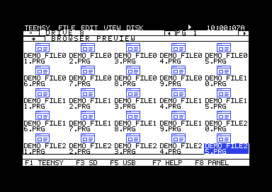
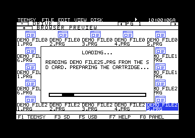
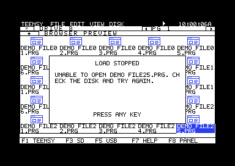

# V1.0.2 browser and loading dialogs

The icon browser displays 25 entries in five rows. Its two-line icon labels
remain; the separate full-filename strip is removed. The last label ends above
the browser frame and shortcut bar. SD/USB and IEC pages both hold 25 entries;
the classic recovery list keeps its 19-entry pages.

Loading activity and backend messages share a centered dialog. The moving bar
indicates activity rather than a completion percentage. Errors preserve the
latest message until a key is pressed. Other information dialogs consume the
first key, click, or joystick fire so a dismissal cannot launch a hidden icon.

These are captures of the actual assembled renderer in VICE with 25 local
sample records. The preview bypasses only the unavailable TeensyROM page-map
handshake. It performs no SD/USB operations, game launches, or firmware updates.

Reproduce them with `Source/C64/MainMenuCRT/preview-desktop.ps1 -Browser -Capture`.
Add `-LoadingMessage` or `-LoadingError` for the two dialog captures.

The complete desktop/backend suite passes 179 tests, with no skips. The
production mapping tests exercise 350 cases, including 25/26-entry
boundaries, hidden parent entries, classic/desktop switching, a 4,000-entry
directory, and deletion across page boundaries. Assembled C64 tests check the
fifth row, selection and input handling, contained message drawing, serial
message draining, and preservation of the latest error text.

The resident desktop uses 22,179 of its 22,528 bytes; the compact cartridge uses
7,541 of 8,192 bytes, and resident apps use 3,448 of 4,096 bytes. Both generated
firmware headers were rebuilt after the source checks.

This is software and emulator verification. Physical C64/TeensyROM+ browsing,
loading, and input behavior still need hardware acceptance. The complete
combined firmware build is recorded separately by its release manifest.
