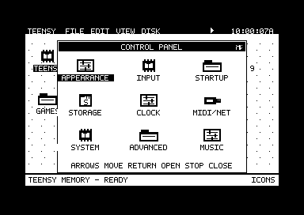
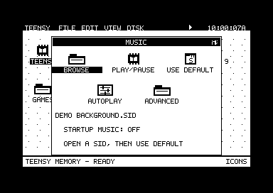
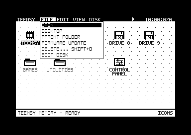

# V1.0.3 desktop controls validation

This release addresses Help routing, selection delays, disk boot, and the
Control Panel/Music interface. The native AGI engine and cartridge ABI are
unchanged from V1.0.2.

## Executed checks

The desktop/backend suite passed 198 tests with no failures or skips. The compact
menu uses 7,541/8,192 bytes, the expanded desktop 22,503/22,528 bytes, and resident
apps 4,092/4,096 bytes; the build enforces all three boundaries. Legacy text/SID
code was relocated into the already protected app region to retain its features.

The focused suite assembles the production desktop and resident app payloads
and executes their 6502 instructions. It checks F1 Help/F7 Teensy routing,
mouse selection and repeat clicks, double-click arming, modal input, all control
category targets, keyboard navigation, and Music's existing firmware commands.

The IEC tests execute both Drive 8 and Drive 9 wildcard boot paths, selected
folder/image entry, unsupported-source notices, failures before handoff, BASIC
RUN and machine-code launch, and the relocated tape loader after desktop memory
has been overwritten. The retained classic text viewer and advanced SID controls
also execute through their relocated app-memory entry points with balanced
returns. See [disk boot semantics](GUI-DISK-BOOT.md).

The combined firmware build verifies all 86 selected GUI inputs and all three
generated headers (compact menu, expanded desktop, and Help). The final audit
checks that these exact bytes are in the combined HEX and full linked image,
plus native source hashes and the protected stack/heap reservations.

Selection checks confirm that changed SD/USB/IEC focus writes only 32 visible
and 32 pending palette bytes; repeated focus writes none. Control selection
copies 288 bitmap bytes instead of scanning 8,000. Home selection changes only
the old/new labels and status footer, matching a freshly rendered frame even
for moved icons and two-line labels. The bank, IRQ state, pointer, and double-click
arming are preserved.

The integrated native firmware harness also passed: 862 gameplay frames,
350 accepted inputs, 350 rejected competing writes, 64 direction reversals,
and 1,184 packets. Its simulated input path recorded zero interrupt masks.
This reuses the unchanged V1.0.2 SQ1 cartridge data; it is a software conformance
check, not physical gameplay acceptance.

## Emulator appearance

These captures run the production renderer in hidden VICE, with a sample SID
filename and no Teensy file backend. They establish layout, not SID playback or
physical mouse/IEC timing.

## Hardware boundary

No hardware was flashed in this task. Verify F1 Help, changed/repeated icon
clicks, Control Panel X/keyboard targets, playing and saving a SID, and IEC disk
boot on the real C64/TeensyROM+ setup. GEOS requires a compatible disk boot program
and drive/device; the wildcard action does not supply GEOS drive emulation.

## Released artifact

The final combined-image audit passed. Firmware SHA-256:

`3ea79a98e6794a942e774e26d590b8fb836ad62384ccdb0804ee3f6899490a37`

The image is 6,175,445 bytes. MinimalBoot retains 16,416 bytes of stack
reserve and 271,488 bytes of RAM2 heap reserve. All 11 release/provenance checks
passed. The [native11 manifest](../../releases/native11/manifest.json) records the
source and tool hashes; the GUI snapshot contains 86 pinned files.
