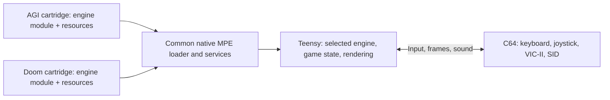

# Doom on MHS Power Engine

Status: proposed implementation plan; no Doom port or performance proof has been completed.
Documented: 2026-09-01.

## Objective and agreed direction

Run a native ARM Doom engine on TeensyROM+ Fab0.4 / Teensy 4.1, with the real C64 providing VIC-II video, SID output, keyboard, and port-2 joystick input. Start with a playable E1M1, then pursue the complete shareware episode and a compact cartridge package.

The longer-term platform goal is one installed MPE firmware that can load either an AGI engine module or a Doom engine module supplied with a cartridge. AGI-64 has not shipped, so its MPE build can migrate to the new module model alongside the compiler and firmware. Permanent compatibility with the tiny PowerVM v1 interface is not a requirement of this design. Preserve working releases as regression references and recovery copies during development.

“V2” here means the proposed next native engine platform. It does not mean the historical MPE2 6510-emulation service, nor does it assign new wire-protocol numbers. Choose unambiguous identifiers when specifying the module ABI.

## Starting point: AGI is already native

The existing AGI interpreter, parser, motion, collision, rendering, and game state already run as native C++ on the Teensy. The C64 presents frames and sound and supplies input. There is no new 6502-to-C++ AGI port to undertake.

- [Native engine](../engine/native-game/mpe4_game.h): existing host callbacks and bounded `Game::tick` execution.
- [Session and buffers](../engine/native-game/mpe4_session.h): game/renderer state, frame publication, and the existing 64 KiB session arena.
- [Firmware integration](../engine/native-game/mpe4_firmware.h): native engine sources currently compiled directly into firmware.
- [Firmware guide](../docs/FIRMWARE-GUIDE.md): supported hardware and division of responsibilities.
- [Native tests](../tests/README.md): real engine, session, renderer, firmware, and artifact checks.

At present, engine code lives in firmware and the CRT contains game resources. Cartridge-loaded native engine code is a new loader/ABI milestone. The old PowerVM limits of 255 code bytes and 256-byte input/output buffers do not constrain this work. Neither a 16 KiB program cap nor a WebAssembly dependency has been selected.

Repository ownership:

| Repository | Responsibility |
| --- | --- |
| `E:\MHS-Repository\Teensy-Rom-Custom-GUI` | Native engines, firmware, selected GUI, module runtime/loader, native tests, firmware releases |
| `E:\MHS-Repository\AGI-64` | AGI compiler, resource packaging, C64 presenter/input code, cartridge construction, compiler integration |
| This `doom/` directory | Doom plan and future Doom-specific source, packaging tools, and documentation |

This plan was checked against engine repository HEAD `c6b4694eaf7dc1908ad6830ec2e750bcfa5073b8` and its existing working changes. Native source and tests were already modified. An untracked `0037-Stream-native-cartridges-up-to-four-MiB.patch` was present, while the builder's patch list still ended at 0036. Treat that work as an in-progress dependency; do not assume a complete build or qualified 4 MiB support. Refresh the baseline before implementation and preserve concurrent work.

## Architecture

The first Doom proof may link the engine into a test firmware, as AGI does today, behind the proposed common interface. That is an intermediate integration step, not completion of the cartridge-module goal. It lets the memory and video questions be answered before building a general native loader.

The common interface should cover:

- Engine initialization, bounded stepping, rendering, shutdown, and error reporting.
- Declared code, read-only data, working memory, stack, and optional PSRAM requirements. Load one game engine at a time and release its allocations on exit.
- Bounded resource reads from cartridge/SD with an explicit cache budget.
- Timestamped held controls plus separate text/menu events.
- Frame submission, display format/palette metadata, and acknowledgement of completed presentation.
- Sound events or SID command submission, keeping timing-sensitive C64 service responsive.
- Engine- and package-specific save/load data with versioned state and atomic replacement.

Keep the generic interface independent of AGI room, VIEW, parser, and opcode concepts. Existing AGI callbacks are a useful implementation reference, but Doom must not have to impersonate an AGI game.

For cartridge-loaded ARM code, specify the module header, target CPU, ABI version, entry points, imports, section sizes/alignment, relocations, BSS initialization, cache maintenance, and unload behavior. Validate all offsets and declared memory requirements before activation. Define the accepted-code trust/isolation model: checksums and relocation bounds alone do not sandbox arbitrary native instructions. Module loading must not corrupt the firmware's bus handlers or an active presentation transaction.

## Doom source selection

Select and pin an upstream revision after the first memory/build comparison. Reuse an existing Doom engine and replace its platform interface.

| Candidate | Why inspect it | Main adaptation question |
| --- | --- | --- |
| [MCUME Teensy Doom](https://github.com/Jean-MarcHarvengt/MCUME) | Doom already runs on Teensy 4.1 | Replace its display/input/audio backend and measure memory alongside TeensyROM |
| [RP2040 Doom](https://github.com/kilograham/rp2040-doom) | Small-memory implementation and highly compressed shareware resources | Separate portable engine/resource work from RP2040-specific rendering, multicore, and peripheral code |
| [Doom8088](https://github.com/FrenkelS/Doom8088) | Useful reduced-detail techniques, including flat floors/ceilings | Reuse suitable techniques or portable code without carrying over DOS/16-bit hardware assumptions |
| [FastDoom](https://github.com/viti95/FastDoom) | Performance and reduced-colour rendering reference | Its DOS/x86 backend is not the native Teensy integration target |

Do not choose a source solely because its standalone executable is small. Compare linked code, peak working memory, cache requirements, and measured rendering time. Preserve upstream notices and record the selected source/license; keep user-supplied WADs and generated game packages outside tracked source.

## Memory and storage

### Working memory

The existing AGI session must fit its 65,536-byte arena. That is an AGI implementation constraint, not the intended limit for Doom or engine modules.

The retained native05 build record at `E:\Codex\AGI64-MPE2\Build-MPE4-Firmware-05\manifests\firmware-build.json` reports 16,416 bytes of stack reserve and 273,536 bytes of RAM2 heap reserve. These are build-time baseline figures, not measurements of currently unused gameplay memory. The [firmware builder](../scripts/build-firmware.ps1) enforces minimum reserves of 16 KiB stack and 256 KiB RAM2 heap. Refresh the linked map and runtime high-water measurements before assigning a Doom budget; do not add the existing session arena and heap figures together as if both were unoccupied.

Measure engine code/data, framebuffer/conversion buffers, level state, resource cache, stack high-water, and temporary decompression allocations. Keep cartridge interrupt handlers in the required fast memory. Do not bypass memory guards merely to make a build pass.

AGI currently operates without optional PSRAM. Doom's requirement is undecided. Check the test board's actual fitted memory and compare an internal-RAM configuration with a PSRAM configuration where available. Publish the resulting minimum hardware requirement explicitly; do not assume PSRAM is installed.

### Cartridge and SD data

The shareware `DOOM1.WAD` is 4,196,020 bytes according to [FastDoom's supported-WAD table](https://github.com/viti95/FastDoom/blob/master/README.txt). It does not fit unchanged in a 2 MiB cartridge; it is also slightly larger than 4 MiB before cartridge code and metadata.

[RP2040 Doom's compression write-up](https://kilograham.github.io/rp2040-doom/flash.html) reports approximately 1,758 KiB of converted shareware data, allowing that port and the episode to fit in 2 MiB flash. This is a useful precedent, not a measured size for our package. Native engine-module bytes, C64 client, indexes, alignment, and reserved banks all count toward our final cartridge capacity.

Start with E1M1 and its required shared resources. Permit a separate asset file on the Teensy SD card during the proof, with explicit read/seek/cache integration. Then measure a self-contained 2 MiB converted package. Larger cartridge support can be evaluated once its separate implementation and hardware path are qualified. Storage capacity does not replace working RAM.

## Video, controls, and sound

### Video and simulation timing

The current native AGI route uses C64-pulled, immutable packets with CRC/commit checks and explicit ACKs. It does not use gameplay bus-master DMA. Retained older DMA services do not prove a continuous Doom transfer path.

Current cell records contain 12 bytes, with at most 19 cells per packet. Updating all 1,000 screen cells therefore requires 12,000 payload bytes in 53 packets, before packet headers/checksums and sound. The C64 also copies, validates, applies, and acknowledges them. Doom camera motion changes much more of the screen than typical AGI actor motion.

Benchmark a representative continuously moving view first. Record render time, C64 colour conversion, cache/SD stalls, transfer time, input latency, and end-to-end frame-time distribution. Use both typical motion and worst-case whole-view changes. A native host test or static screenshot cannot establish physical throughput.

Start with a 160-pixel-wide logical multicolour view and a reduced-height viewport with a HUD. Evaluate a stable small palette, bitmap-only updates where valid, and larger sequential transfer blocks before adding complexity. Respect the VIC-II four-colours-per-cell restriction, including the shared background colour. Any alternative transfer path requires its own real-hardware proof. Set an FPS acceptance target from the initial benchmark and visual trial; none is promised yet.

Keep Doom's 35 Hz simulation clock independent of display acknowledgements. Bound catch-up work after stalls so slow presentation does not permanently slow gameplay or starve input/audio. The existing AGI frame-ACK scheduling must be adapted, not copied unchanged.

### Controls

Reuse the C64 scanner, mailbox, and joystick plumbing. The AGI keyboard path currently sends a selected key event; Doom needs simultaneous held actions and reliable release detection.

Initial mapping proposal:

- Keyboard: cursor keys for forward/back and turning, separate strafe keys, fire, use/open, run, weapon selection, and pause/menu.
- Port-2 joystick: forward/back, turn, and fire; keyboard supplies use, strafe/run modifiers, and weapon selection.
- Support keyboard and joystick together. Verify move + turn + fire and strafe + fire combinations against the C64 matrix's actual limitations.

Use held-action bits or press/release events for gameplay and keep text/menu events separate. Verify that releasing a control, changing menus, or exiting a game cannot leave an action stuck.

### Sound

Reuse SID delivery, but add Doom-specific sound mapping. Basic recognizable firing, impact, pickup, and door effects are the first playable target. Original sampled effects and music require a separately measured audio/conversion design; the AGI three-voice score player does not implement them automatically.

## Implementation phases and completion checks

### 1. Memory and moving-view proof

- Pin a candidate Doom source and record its toolchain and asset identity.
- Build the native core and measure linked sections and peak memory with E1M1.
- Generate representative Doom frames and convert them to the proposed C64 view.
- Present a continuously changing view through the actual native transport on hardware; exercise keyboard and joystick input during transfer.
- Produce a short report with hashes, video standard, memory requirements, timing distribution, and the selected viewport/transport approach.

Complete when a real C64 moving-view trial and a defensible memory budget support the next phase. If they do not, revise the port, viewport, transport, or PSRAM requirement before committing to a full game integration.

### 2. Playable E1M1

- Integrate resource loading, engine initialization, bounded simulation, rendering, and exit through the shared native interface.
- Implement held keyboard/joystick actions and basic SID effects.
- Preserve actual Doom map/gameplay behavior: player movement/collision, enemies, weapons, doors, pickups, damage/death, restart, and the level exit.
- Add health/ammo HUD and a minimal menu. Begin with reduced detail where needed; record intentional visual/audio compromises.
- Run deterministic engine/input tests and compare converted frames with the host reference, then play the level from start to exit on the real C64.

Complete when E1M1 is playable through its exit with both input methods, stable memory use, responsive controls, and recorded physical performance. A rendered title or prerecorded fly-through is not this milestone.

### 3. Shared native v2 engine modules

- Specify the engine ABI and container based on both the existing AGI core and the Doom proof.
- Implement the native module packer/loader, imports, relocation rules, memory accounting, failure recovery, and clean shutdown.
- Extract the already-native AGI engine into the same module model. Update the AGI compiler, presenter integration, and firmware kit together.
- Test loading AGI and Doom with one firmware installation, returning to the menu, releasing resources, and loading the other engine without stale state.
- Reject malformed/incompatible modules before execution and preserve the working release/restore artifacts.
- Re-run meaningful AGI native/session/presenter and hardware regressions, including parser, movement, room changes, sound, and saves. Do not imply old saves are compatible if their schema changes.

Complete when both engines work as cartridge-supplied modules under the common firmware. A test firmware with both engines compiled in is useful evidence but does not complete this phase.

### 4. Shareware episode and release preparation

- Extend resource packaging to every shareware level and its common assets; measure the complete CRT and any external SD dependency.
- Add intermissions, game-over/restart flow, settings, and save/load with engine/package-specific identity.
- Improve visuals and audio within the measured frame budget.
- Exercise all episode levels, stress large scenes and cache misses, and test supported PAL/NTSC hardware configurations.
- Publish matched firmware, module/cartridge, source pins, checksums, controls, hardware requirements, measured performance, and known limitations.

The episode's exact final cartridge size and frame rate remain open until measured. Multiplayer, additional Doom games, and expanded controller types are outside the first release target.

## Effort estimate

These are preliminary focused engineering estimates, not a delivery promise or measured progress. They assume reuse of an existing embedded Doom engine and successful memory/video proofs. Physical test availability and unexpected bus/cache problems can extend elapsed time.

| Milestone | Estimate |
| --- | --- |
| Memory fit plus moving-view technical proof | 1–2 focused development days |
| Playable E1M1 with keyboard/joystick and basic SID effects | Approximately 1–2 weeks total, including the proof |
| Shared v2 cartridge-module platform, AGI migration, episode support, and polished release | Several additional weeks; refine after the proof and ABI design |

Getting Doom playable and completing the general module platform are separate deliverables. Do not quietly count a firmware-linked prototype as the finished v2 system.

## Work boundaries and next action

Implementation has not started under this plan. The next action is phase 1: establish the exact native source/build baseline, choose a candidate port, measure memory, and demonstrate a moving view through the real C64 presentation path.

Keep Doom-generated output under an ignored `build/doom/` directory or an explicitly named external build directory. Preserve unrelated working changes, selected GUI source, accepted hardware pairs, and normal AGI release outputs. Record source/firmware/asset hashes with evidence. Build and host checks, emulator boot checks, and physical gameplay acceptance must be reported separately. Firmware flashing, publication, and release replacement are not performed by this documentation task.
