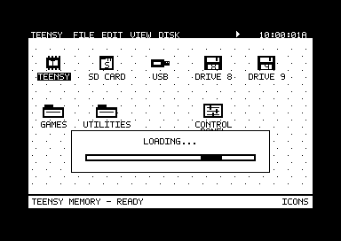

# Native MHS Power Engine firmware

Download [MHS-PowerEngine-TRPlus-v1_full.hex](MHS-PowerEngine-TRPlus-v1_full.hex?raw=true)
for TeensyROM+ Fab0.4 with Teensy 4.1. The **native09** image includes the
current desktop and native MHS Power Engine.

- Folder and drive windows omit the extra `/.. <Up Dir>` entry. Use the window
  Up button or Up-arrow key; the classic text menu keeps its original entry.
- ROM launches display a lower-center **Loading...** panel with an animated
  activity bar. It shows activity without claiming a completion percentage.
- Firmware-update confirmations and launch error messages remain available.

This release retains the desktop apps and Copy, Paste, and permanent Delete
for individual SD/USB files. The native AGI engine sources are unchanged from
native08, including the corrected dialogue key waits. Existing native06,
native07 and native08 cartridges and saves remain compatible. Launch native
game cartridges from the **SD card**; no cartridge rebuild is needed.

Read [the firmware guide](../docs/FIRMWARE-GUIDE.md) for installation, controls,
saves and recovery. The [official restore image](../releases/native09/TeensyROM+_0.8_OFFICIAL-RESTORE_full.hex)
is preserved in the versioned release kit. The ready-to-use
[Black Cauldron demo](../Demo/README.md) remains available.

Firmware SHA-256:

`b55e6b4882efa0c384de8d1f2592fc890c6442ccb784f7db2618b72537f20850`

[Checksums](../docs/firmware/SHA256SUMS.txt),
[source lock](../docs/firmware/source.lock.json), and
[release manifest](../releases/native09/manifest.json) identify the exact files.
Build inputs: [0da8aa0](https://github.com/ziggystar12/Teensy-Rom-Custom-GUI/tree/0da8aa0b38f3fd72dfc9bd5ae0dbe6a068255fc3);
reviewed desktop: [17c11f7](https://github.com/ziggystar12/Teensy-Rom-Custom-GUI/commit/17c11f7222df5b11acdf36758b758ab1ba2e6dfb).

All 169 desktop/backend tests passed, including 55 directory-map scenarios,
36 file-operation fault scenarios, and executable C64 loading/IEC checks.
The full dual firmware build passed its memory guards. Both linked firmware
halves and the assembled GUI assets match the combined HEX. The loading panel
was visually checked in VICE. See the [validation record](../docs/firmware/native09-validation.json).
This firmware has not been flashed here; physical hardware acceptance remains
separate from these checks.

This folder contains only this README and the current combined image.
Supporting documents are in `docs/`; earlier immutable kits remain in
`releases/`. Read [File Operations](../docs/FILE-OPERATIONS.md) for controls.
Build the combined image with [the root builder](../scripts/build-firmware.ps1).
